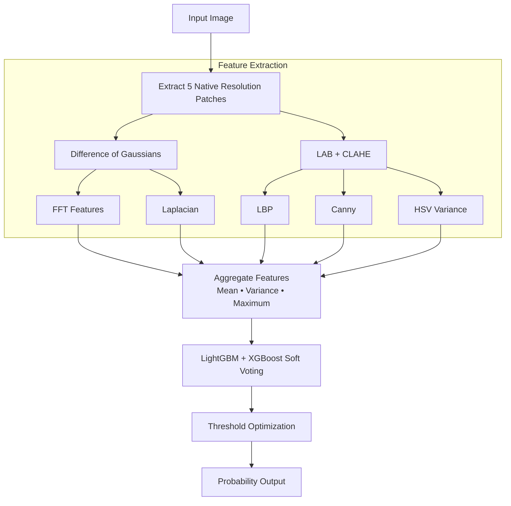

# Spot the Fake Photo
### Classical Computer Vision & Machine Learning Pipeline for Screen Recapture Detection

A lightweight, production-oriented computer vision system that detects whether an image is a **genuine photograph** or a **photo of a digital screen (screen recapture)**.

The pipeline relies entirely on **classical computer vision** and **gradient boosting models**, avoiding deep neural networks while maintaining high accuracy and low latency.

---

## Executive Summary

- **Accuracy:** 92.86%
- **ROC-AUC:** 0.9646
- **F1-Score:** 92.47%
- **Latency:** ~87.9 ms/image (Laptop CPU)
- **Model Size:** 216 KB
- **Deployment:** 100% On-device
- **Cloud Cost:** ~$0

Instead of relying on large CNNs, this project extracts deterministic, physics-inspired forensic features such as **moiré patterns**, **pixel-grid interference**, and **frequency-domain artifacts**, enabling fast and explainable inference on commodity CPUs.

---

# Why This Approach?

Most approaches to this problem immediately use deep learning architectures such as **ResNet**, **EfficientNet**, or **MobileNet**.

This project intentionally takes a different approach.

## Preserve Physical Evidence

CNNs typically resize images to around **224×224**, which removes much of the microscopic information responsible for identifying screen recaptures.

Instead, this pipeline:

- Preserves the original image resolution
- Extracts **five fixed native-resolution patches**
- Preserves moiré, aliasing, LCD pixel grids and other optical artifacts

---

## Physics Instead of Semantics

Rather than recognizing scene content, the model searches for physical evidence introduced when a display is photographed.

The pipeline explicitly models:

- Difference of Gaussians (DoG)
- Frequency-domain spikes (FFT)
- Micro-textures (LBP)
- Edge degradation
- Illumination variance

These handcrafted features are then classified using a lightweight ensemble.

---

## Built for Edge Deployment

The final system is intentionally small.

- Model Size: **216 KB**
- CPU Latency: **<100 ms**
- No GPU required
- No cloud inference
- No user images leave the device

---

## Explainable Predictions

Unlike end-to-end CNNs, every prediction can be analyzed.

Feature importance, FFT responses, misclassified samples and threshold calibration can all be inspected, making debugging and future improvements significantly easier.

---

# Pipeline Overview



---

# Feature Engineering

The image is divided into **five fixed 256×256 patches**:

- Top Left
- Top Right
- Bottom Left
- Bottom Right
- Center

Each patch is processed independently before feature aggregation.

---

## Difference of Gaussians (DoG)

Acts as a band-pass filter by suppressing low-frequency illumination while emphasizing high-frequency structures where screen artifacts exist.

---

## Fast Fourier Transform (FFT)

Detects periodic frequency patterns introduced by LCD/OLED pixel grids.

Extracted descriptors include:

- Peak strength
- Peak anisotropy
- Spectral entropy
- Off-axis peak count
- High-frequency energy
- Residual frequency spikes

---

## Local Binary Patterns (LBP)

Captures microscopic texture differences produced by display panels.

Uniform LBP (`P=8`, `R=1`) produces a compact and robust descriptor.

---

## Laplacian Statistics

Measures edge sharpness and blur.

Screen recaptures generally lose high-frequency detail after the second imaging process.

---

## HSV Variance

Uses saturation and value variance while intentionally removing absolute color means to avoid learning lighting bias.

---

## Canny Edge Density

Measures structural edge density remaining after image capture.

---

# Training Strategy

The model is trained using:

- Stratified 5-Fold Cross Validation
- Hyperparameter Search
- Early Stopping
- Soft Voting Ensemble

Final ensemble:

- **LightGBM (20%)**
- **XGBoost (80%)**

### Threshold Optimization

Instead of using the default threshold of **0.50**, thresholds from **0.30–0.70** were evaluated in **0.001** increments on the validation set.

The threshold producing the highest validation accuracy was fixed before evaluating the unseen test set.

---

# Results

| Metric | Value |
|---------|------:|
| Accuracy | **92.86%** |
| Precision | **95.56%** |
| Recall | **89.58%** |
| F1 Score | **92.47%** |
| ROC-AUC | **0.9646** |
| PR-AUC | **0.9748** |
| Latency | **87.94 ms/image** |
| Model Size | **216 KB** |
| Cloud Cost | **≈ $0** |

---

# Project Structure

```text
.
├── config.py
├── utils.py
├── patches.py
├── features.py
├── train.py
├── predict.py
├── model.pkl
├── metrics.json
├── requirements.txt
├── README.md
├── report.md
├── tests/
│   ├── test_patches.py
│   ├── test_features.py
│   └── test_predict.py
└── analysis/
```

---

# Installation

```bash
python3 -m venv .venv

source .venv/bin/activate

.venv/bin/pip install -r requirements.txt
```

---

# Training

```bash
.venv/bin/python train.py
```

---

# Prediction

```bash
.venv/bin/python predict.py image.jpg
```

Example output:

```text
0.927351
```

where

- **0 → Real Photo**
- **1 → Screen Recapture**

---

# Testing

Run the complete test suite:

```bash
python -m pytest
```

---

# Future Improvements

With additional development time, the system could be improved by:

- Expanding the dataset with more devices, displays and lighting conditions
- Mining hard-negative examples from real-world failures
- Adding more robust frequency-domain descriptors
- Reducing inference latency further through feature selection
- Compressing the ensemble into a single lightweight model for mobile deployment